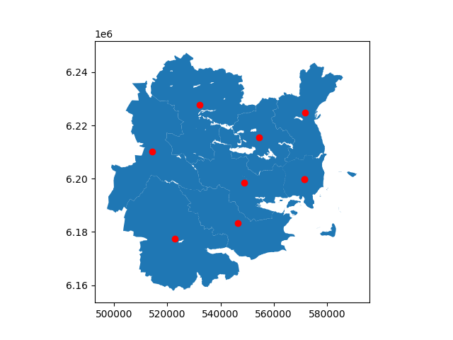

# GeoJSON Processing

This project demonstrates how to process and visualize GeoJSON data using Python. The input file used is `open_adm_kommunegraenser_view.json`, which contains geographical boundaries.

## Code Overview

The code performs the following steps:
1. Loads the GeoJSON file using GeoPandas.
2. Sets the active geometry column.
3. Ensures the coordinate reference system (CRS) is set to EPSG:25832.
4. Plots the geographical data.
5. Plots the centroids of the geometries in red and saves the output as `polygon_centroids.png`.

## Output

The output of the code is a PNG file showing the geographical boundaries with centroids marked in red.

